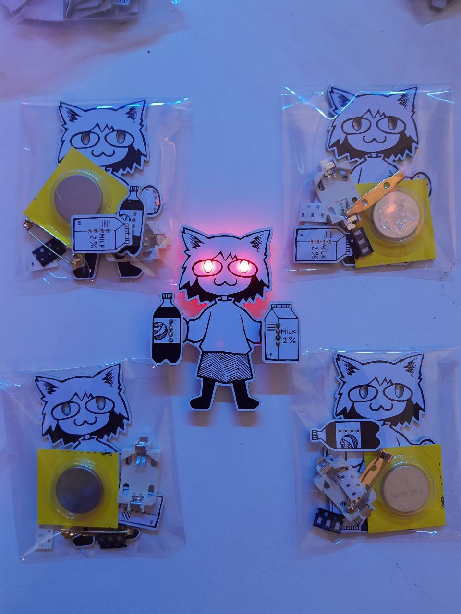
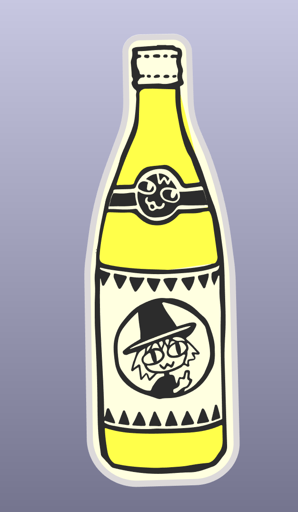
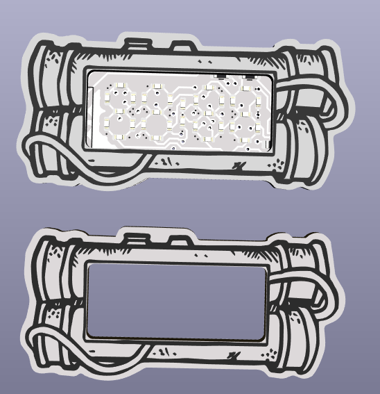
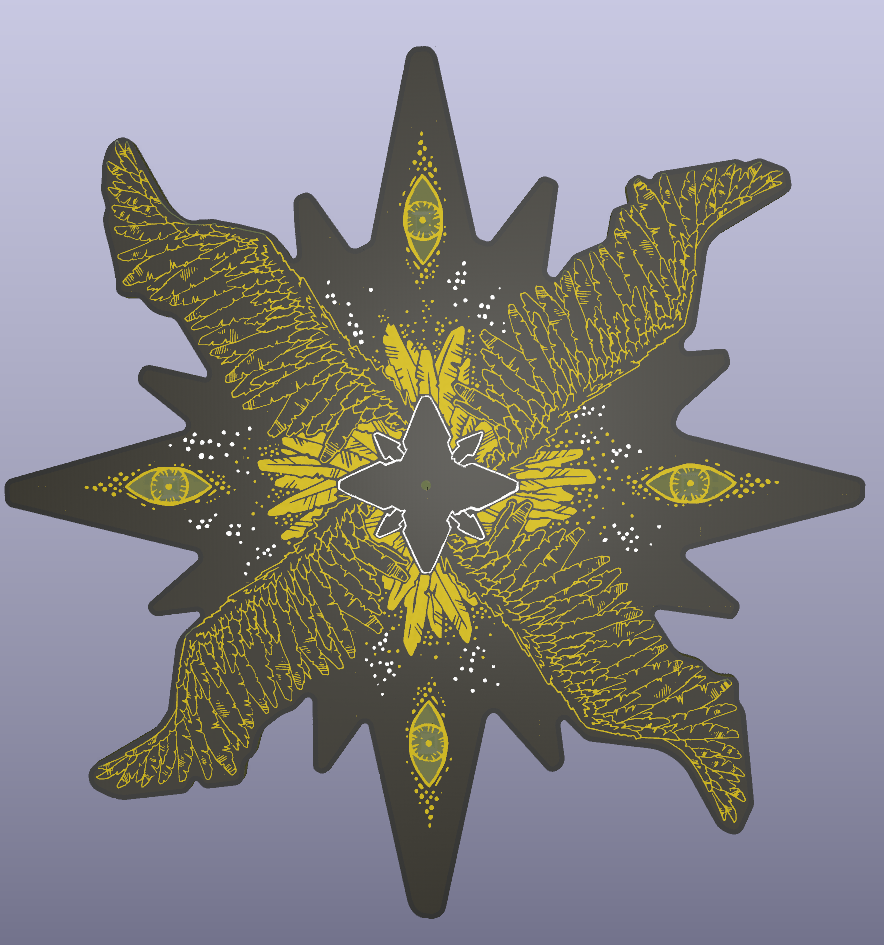
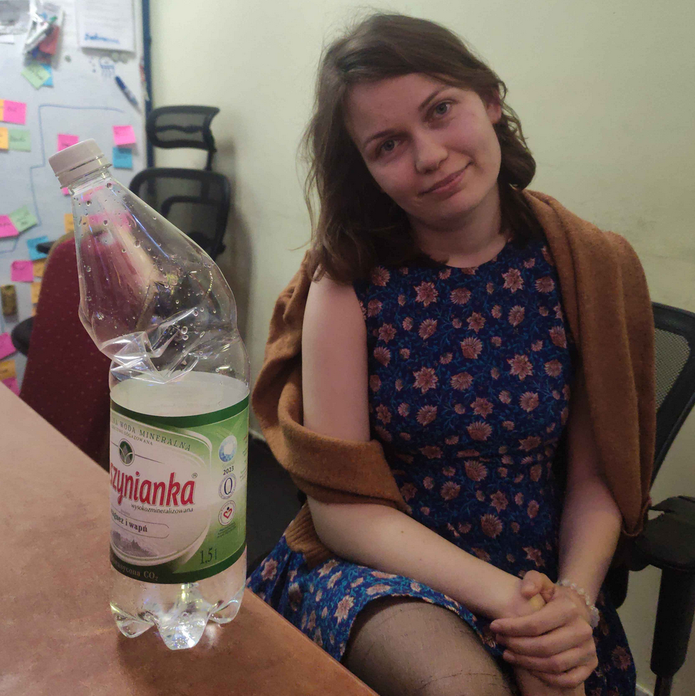
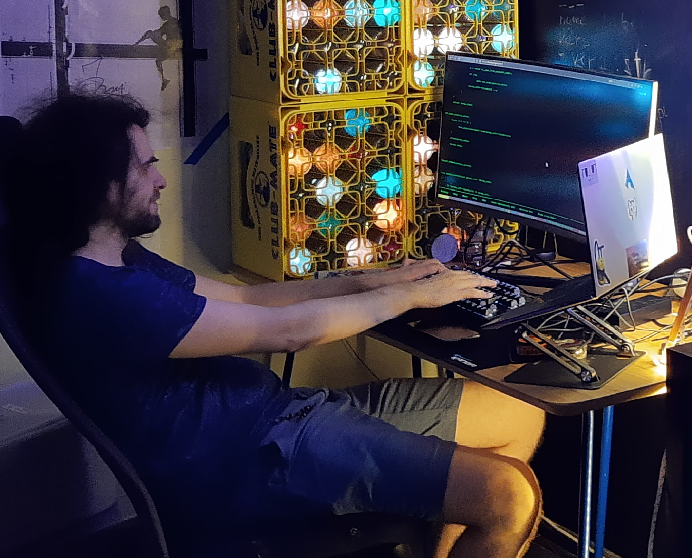

# Rough Rat electronics

Hi, we're @cr1tbit and @wilyweasel. We met at [Hackerspace Pomerania](hsp.sh) (@hspsh)

We decided to join our hardware and artistic skills to start this small brand, exploring the unusual trade of PCB art and technology-driven shitposting.

Our creations are mostly open source, we invite everyone to contribute with ideas (and to extend the pilky addon standard when it hopefully soon catches on)

This profile and project repositories are still work in progress.

# FAQ
### Q: what direction should LEDs be soldered in?

A: We forgot to explicitly mark it on some badges. They should be soldered upside-down, like this:

### Q: How much did you pay for blobbadges (the one with CCC logo)?

A: I'm terribly sorry, I've been telling lies for the first 2 days of the event - **it's closer to 5eur** (not 10eur). The calculations include +50% for extra fast shipping we needed :)

- 1st batch (30pcs) costed $15 in PCBs + $75 for assembly.
- 2nd batch (120pcs) costed $60 in PCBs (gold-plated in 2x2 panel) + $260 in components
- the fronts (120pcs) costed $40
- CR2032 + holder - $0.50 / pcs
- button + pin - $0.50 / pcs

Considering additional costs (transportation, developing debug fixture, granting some change money for others helping us at our desk) we might be able to gain a bit of a surplus after the event. Since we run our own friend ticket system at hackerspace pomerania, this surplus will cover the tickets for this year. We won't buy stupid crap with it, I promise.

### Q: what is the rough manufacturing cost of the cyberbadges? Are they your project?

A: I (critbit) made a horrible mistake, thinking that noone would be interested in buying an 80eur cyberbadge, so I did not bring more of them. Their manufacturing + component cost is somewhere around 65eur, however 7/30 PCs arrived dead due to one ore more of the WS2812 LED not being soldered correctly and/or not working.

For this device to be guaranteed not to bring any loses to us, its' price should be closer to 160eur probably.

The new revision has been split into a dumb frontboard, and an independent brain module (https://github.com/cr1tbit/pilkbrain, not documented as of time I'm writing this). 

The LED matrix with no MCU / battery charger, costs 6usd (4L pcb) + 50usd assembly (@5 units). The schematic is inspired by the cheap HUB75 LED matrices. The price could considerably go down with scale. 

Assembling 256x5 LEDs costs only 7USD. Since the 1515 RGB LED is so cheap, 1/3 of that price comes from the flat per-component fee.

The brain module costs around 100usd/5pcs, but it's very much in development stage. It could be replaced by a much cheaper solution for sure.

### Q: we have a problem with some badge / inquiry / want to say hi:

We'll get a domain with mailbox soon maybe probably. In the meantime, you can:

* message us on instagram (link on the top)
* message me on the matrix.org instance - `cb1t`

### Q: how do i tinker with firmware for the blobbadge?

You use generic rust toolset, however, nightly is needed. After initial setup it should work rather well, however I still need someone to try to set this environment independently from me, to confirm this works OOTB.

For programming, sadly you need an external probe. A DAPLink might be used, they may be expensive, but I heard you can get something working from aliexpress by searching `CMSIS DAP/DAPLink Simulator STM32 Debugger Downloader U Disk Drag And Drop Super JLINK/STLINK`

Then you can use a generic 2x5 1.27pitch programming clip from aliexpress (can't find the link now) or 3d-print a fixture for this (I'll provide 3d files and instruction for this on the beginning of 2025) 

# Random showcase

  
 
  

 

# About us

### Weasel

### Critbit

My $dayjob is C/Linux programming, I also take some commisions for electronics/firmware development.

I love clean schematics, challenging myself to create cheap yet usefull devices and out-of-the-box thinking when solving hardware product challenges.

